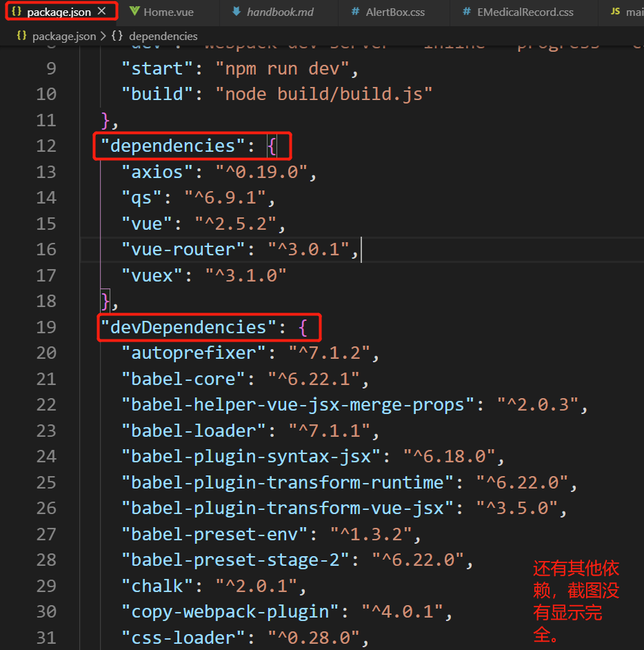
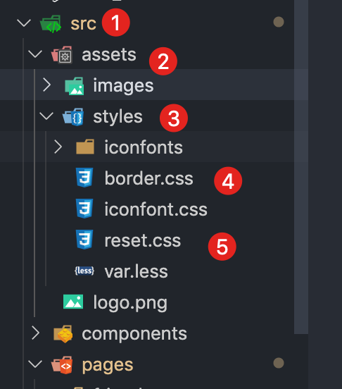

# 云医疗项目-医生模块实施手册-第一阶段

## 一、构建项目（带路由功能）

### 1.1 创建步骤：
 - 1.安装node.js相关环境，如有即可跳过此步骤，node中即包含npm模块
 - 2.通过`npm install -g vue-cli` 安装vue脚手架，其中 -g 表示全局
 - 3.通过`vue -Version`检查vue版本，可以看到版本信息就表示安装成功
 - 4.通过`vue init webpack + 项目名字`（例如：project等，建议使用英文名称）初始化项目内容，此步骤可能花费很多时间。执行过程中需填写项目名称、描述、版本等信息。注意，此步骤会询问是否安装vue-router，此处需要使用该功能。
 - 5.通过`cd 项目名字`进入项目的根目录
 - 6.`npm install`安装依赖，此步骤会查找package.json文件，并安装文件内容自动安装对应版本的依赖
 - 7.`npm run dev`运行本地开发环境，根据提示在浏览器中查看页面效果


## 二、配置项目
            
### 2.1 安装相关联的第三方库（第一阶段所用到的安装）
>项目中会用到一些第三方的插件和库，例如：axios等。在使用插件之前需要先安装该插件，方式很简单，在终端中执行`npm install xxx`即可 ，其中xxx就是插件的名字。安装成功后就会在package.json文件中新增一条依赖.



> dependencies表示公用的依赖， devDependencies表示dev环境下使用的依赖，安装时可通过 `-dev`参数控制.例如 `npm install xxx -dev` 表示此依赖仅作用于dev环境；`npm install xxx` 表示这是公用的依赖。

### 2.2 编辑程序入口文件`main.js`，配置相关优化

> 注意：虽然该项目是PC端，但是也要注意相关优化，保证项目在移动端的适配，尽可能去提早优化措施

##### main.js这个文件中项目的根目录的`src`文件夹下。它是整个项目的入口文件，负责全局事务。例如使用哪些核心插件以及实例化vue对象等。一些核心插件的引入或者使用需要先在这个文件中通过类似`import Axios from 'axios'`的命令引入后使用。

#### 2.2.1 苹果手机屏幕点击300ms延迟

1\.安装`fastclick`：`cnpm i fastclick -S`

2\. 项目入`main.js`口引入`fastclick`: 

```js
import FastClick from 'fastclick';
```

3\. 配置`fastclick`

```js
// 全局调用
FastClick.attach(document.body)
```

#### 2.2.2 2x、3x倍屏幕显示1像素问题

1\. 引入相关`.css`

```js
import './assets/styles/reset.css'
import './assets/styles/border.css'
```

> 相关文件已经实现可以直接使用,在配置项目的时候提前创建好相关目录




### 2.3 引入相关`iconfont`相关字体

以阿里巴巴字体为例

1. 在阿里巴巴`iconfont`官网进行字体库相关项目配置，并下载
2. 在项目中创建目录并导入相关文件
3. 在`main.js`中引入相关`.css` 

```js
import './assets/styles/iconfont.css';
```

  4\. 并在`template`模板中进行测试是否引入成功


项目中也用到了 `Font Awesome` 官网[Font Awesome](http://fontawesome.dashgame.com/)

> 用法见官网

`font-awesome.min.css`

## 三、项目主体架构

> 项目v1.0 版本把登录页做为整站入口页面

### 3.1 登录页面实现

1\. 创建`src/components/Home.vue` 组件


2\. 修改路由


修改根路由`/src/router/index.js`


3\. 实现登录页`Home.vue`的步骤：

`template`

```html
<template>
  <div class="hello">
		<span class="log-title">{{ log_title }}</span>
		
		<div class="login-div">
			<div class="login-content">
				<span class="login-name">{{ login_name }}</span>
				<input placeholder="请输入手机号" class="login-input" type="text" v-model="userName" autofocus>
				<i class="fa fa-phone"></i>
				<input class="login-input userCode" :type="inputType"
					v-model="userCode" @keyup.enter="loginHandler">
				<i class="fa fa-lock"></i>
				<span class="login-forget getcode" @click="getCode">获取验证码</span><br>
				<span class="login-forget">忘记密码？</span>
				<span class="login-btn" @click="loginHandler">登 录</span>
			</div>
		</div>
  </div>
</template>
```

`CSS`

```css
<!-- Add "scoped" attribute to limit CSS to this component only -->
<style scoped>
	@import url("./css/font-awesome.min.css");
	

html,body {font-size: 10px;}
body,ul,li,dl,dt,dd,p{ padding: 0; margin: 0; list-style: none;}
input{ border: 1px solid #999;outline-style: none; text-shadow: none ; text-indent: 5px;}
.div70{ height: 70px; width: 100%; display: inline-block;}
a{ text-decoration: none;}


.hello {
	position: relative;
	width: 740px;
	margin: 0 auto;
}
.log-title {
	position: absolute;
	margin-top: 100px;
	top: 10px;
	left: 200px;
	z-index: 3;
	color: #fff;
}
.login-pic {
	margin-top: 100px;
	position: relative;
	z-index: 2;
}
.login-div {
	width: 400px;
	height: 300px;
	position: absolute;
	background-color: rgba(220, 220, 220, 0.8);
	margin-top: 305px;
	top: -150px;
	right: 0;
	z-index: 1;
	border-radius: 4px;
}
.login-content {
	position: relative;
	width: 300px;
	height: 200px;
	padding-left: 40px;
	margin: 50px 0 0 100px;
}
.login-name {
	color: rgb(49, 192, 229);
	padding-bottom: 5px;
	border-bottom: 2px solid rgb(49, 192, 229);
}
.login-forget {
	color: rgb(49, 192, 229);
	font-size: 14px;
	cursor: pointer;    
	display: inline-block;
	padding: 15px 0;
}
.login-forget:hover {
	text-decoration: underline;
}
.login-input {
	margin-top: 15px;
	display: block;
	width: 190px;
	height: 30px;
	border-radius: 16px;
	box-shadow: #999 -1px 4px 5px;
	padding-left: 30px;
	font-size: 16px;
}
i.fa {
	position: absolute;
	color: #777;
}
.fa-phone {
	top: 45px;
	left: 50px;
	border-right: 1px solid #777;
	padding-right: 5px;
}
.userCode {
	width: 100px;
	display: inline-block;
	margin-right: 15px;
}
.fa-lock {
	top: 93px;
	left: 50px;
	border-right: 1px solid #777;
	padding-right: 5px;
}
.fa-eye,
.fa-eye-slash {
	top: 92px;
	left: 235px;
	cursor: pointer;
}
.login-btn {
	background: -webkit-linear-gradient(left, rgb(49, 192, 229) , rgb(22, 219, 184)); /* Safari 5.1 - 6.0 */
  background: -o-linear-gradient(right, rgb(49, 192, 229), rgb(22, 219, 184)); /* Opera 11.1 - 12.0 */
  background: -moz-linear-gradient(right, rgb(49, 192, 229), rgb(22, 219, 184)); /* Firefox 3.6 - 15 */
  background: linear-gradient(to right, rgb(49, 192, 229) , rgb(22, 219, 184)); /* 标准的语法 */
	margin-top: 15px;
	display: block;
	width: 220px;
	height: 30px;
	border-radius: 16px;
	text-align: center;
	color: #fff;
	cursor: pointer;
	line-height: 30px;
	box-shadow: rgb(49, 192, 229) 2px -1px 5px;
}

</style>
```


`JavaScript`

```js
export default {
  name: 'Home',
  data () {
    return {
			log_title: '医疗管理后台',
			login_name: '医生登录',
			// 输入框类型
			inputType: 'password',
			// 字体图标名称
			iconName: 'fa-eye',
			// 手机号
			userName: '18346547345',
			// 验证码
			userCode: ''
    }
	},

	methods: {
		// 登录
		loginHandler: function() {
			let that = this
			if(this.userName && this.userCode) {
			}else {
				alert(`请将信息填写完整！`)
			}
		},
		// 获取手机验证码
		getCode: function() {
			console.log(this.userName)
		}
	}
}
</script>
```

## 四、补充内容
### 4.1 其他内容
> 关于项目中的接口调用、数据保存以及页面跳转等功能的详细说明见项目根目录下的`handbook.md`文件


